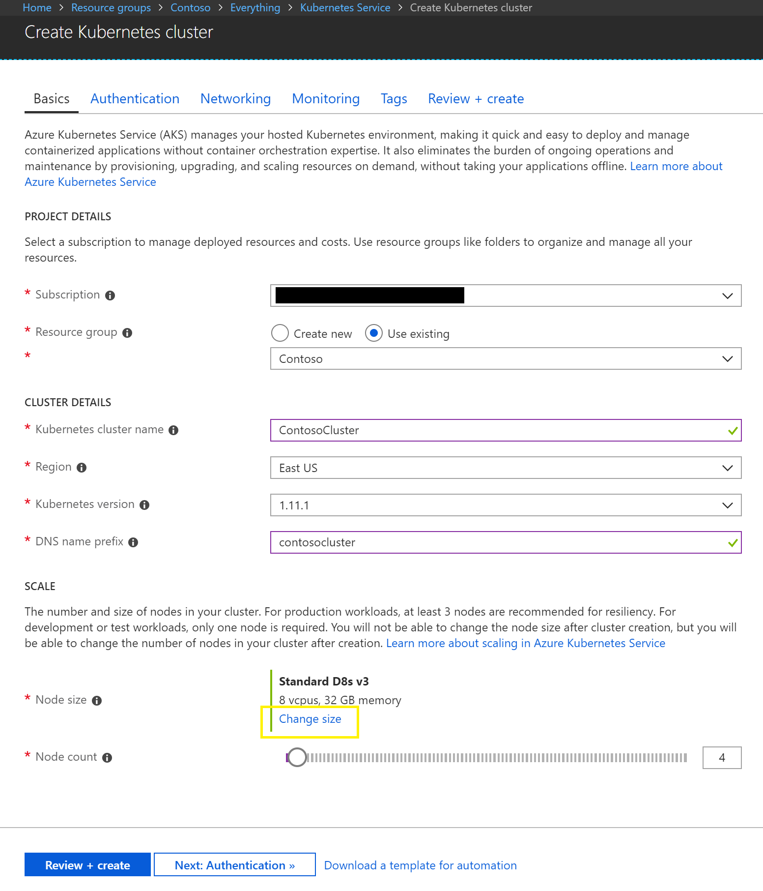

# Azure Kubernetes Service for Cluster Deployment

This is **not the recommended deployment option** for this project. Instead, please see **[Creating the Cluster with ACS Engine (recommended)](ClusterCreation_ACS-Engine.md)**. ACS Engine is preferred because different agent pools can be defined with different types of boxes. For example, a large box dedicated for the simulator and smaller boxes for the robots. As of the time this project was created, AKS only allows for deployments of boxes all the same size. If AKS is chosen, the simulator will likely run in to networking and CPU constraints if it is not on a large box.

## Prerequisites

This doc assumes that these steps have already been completed

- [Environment Setup](EnvironmentSetup.md)
- [Container Management](ContainerManagement.md)

## Create AKS

In the Azure portal, create an Azure Kubernetes Service (AKS).



Choose the number of nodes and type of machines. These can be changed later if needed. The smallest boxes are not recommended since the simulator box will need more compute power than the robots to run, and AKS does not currently support creating a cluster with different type of vms.

## Grant AKS Access to ACR

Follow instructions to [Authenticate with Azure Container Registry from Azure Kubernetes Service](https://docs.microsoft.com/en-us/azure/container-registry/container-registry-auth-aks)

## Set Local Cluster Configuration

To generate a local config file for the AKS cluster and allow use of kubectl commands on the cluster, run:

```az aks get-credentials --resource-group <resource group> --name <cluster name>```

This will merge the new cluster configuration into the .kube config file. Your context will be automatically swapped to this cluster.

## Validation

The way to validate the AKS cluster will be the same as validating ACS Engine.
For more information, see [cluster validation](ClusterCreation_ACS-Engine.md#Validation)