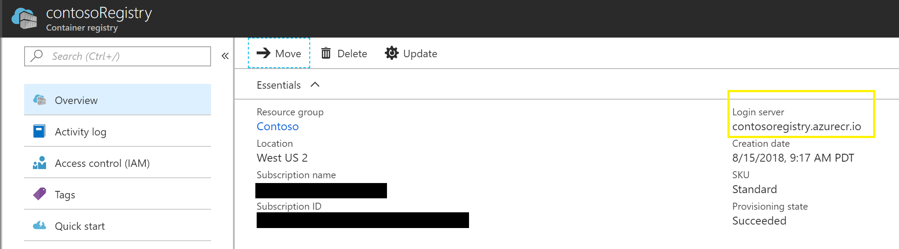

# Container Management

## Why Container Management is Needed

Packaging the code into an image creates a portable, all-inclusive unit that can run in a cluster. [Azure Container Registry](https://docs.microsoft.com/en-us/azure/container-registry/container-registry-intro)(ACR) is a place to store Docker images for the pods in the cluster to pull down when they run. Docker Registry is also an option, but for this project we will use ACR.

## Containers

There are two main containers that run in the simulation. In general, the following services run in each container:

1. **ARGoS Simulator**:
    - ARGoS Simulator:
        - Physics Engine
        - Generates Sensor Data
        - Generates Visualization
    - ROS bridge: Publishes Sensor Data to ROS message bus
    - VNC Server: Enables Remote Connections to View Desktop
    - NIMBRO Communication: Enables Communication to and from Robot Containers
1. **Robot**:
    - Robot ROS Nodes:
        - Robot Controller
        - Navigation
        - Map Server
    - NIMBRO Communication: Enables Communication to and from the ARGoS Simulator Container

## Create Azure Container Registry (ACR)

In the Azure Portal, create a new "Container Registry" resource.  Pick a name for the registry, a new or existing resource group and a region. All other default selections can be left as-is.


## Dockerfiles

Dockerfiles are used to define docker images, which contain the needed files and executables for the simulator and robots to run. The images are then used to initialize the containers.

- [ARGoS Base Dockerfile](../argos/Dockerfile) (`argos/Dockerfile`)
  - Serves as a base image for Dockerfile-argos. It builds the binaries for ARGoS from source.
- [ARGoS Dockerfile](../Dockerfile-argos) (`Dockerfile-argos`)
  - Used to initialize the ARGoS Simulator container.
- [Robot Dockerfile](../Dockerfile-robot) (`Dockerfile-robot`)
  - Used to initialize the Robot container.

## Create Docker (Container) Images

Build the three Docker images for the project. From the repository's root directory, use the following commands

```console
    # Build the ARGoS base image
> docker build -t argos-base . -f "argos/Dockerfile"
    # Build the ARGoS Simulator image
> docker build -t simulator . -f "Dockerfile-argos"
    # Build the Robot image
> docker build -t robot . -f "Dockerfile-robot"
```

The ARGoS base image is referenced to build the ARGos Simulator image. Update the 'FROM' image in [Dockerfile-argos](../Dockerfile-argos) to refer to the local base image.

## Rename and Tag Docker Images

In order to push the Docker images to the ACR, rename them with the name of the registry, and tag them with a helpful tag.
> ```docker tag <imageName:imageVersion> <acr login server>/<imageName>:<imageVersion>```

For example,
> ```docker tag foo:bar contosoregistry.azurecr.io/foo:bar```

Find the ACR login sever in the Azure Portal



## Push Docker Images

1. Log in to the container registry through the Azure CLI.
    > ```az acr login -n <registry-name>```

2. Set up az to point to the subscription where the registry is located.
    > ```az account set -s <"subscription name" or subscriptionId>```

3. Push the Docker images tagged previously
    > ```docker push <acr login server>/<imageName>:<imageTag>```

4. Update [values.yaml](../helm/ros-simulation/values.yaml) file to reference the ACR login server, image name, and tag

## Validate

To view the Docker images in the Azure portal, go to the ACR -> Repositories.


## Helpful Tips

- It is good to clean up unused local Docker images. An image can be removed by id or name:tag.
   > ```docker rmi <id>```
- To get the id, run
   > ```docker images```
- If the Docker image fails to push to the ACR, be sure to log in using
   > ```az acr login -n <registry-name>```
