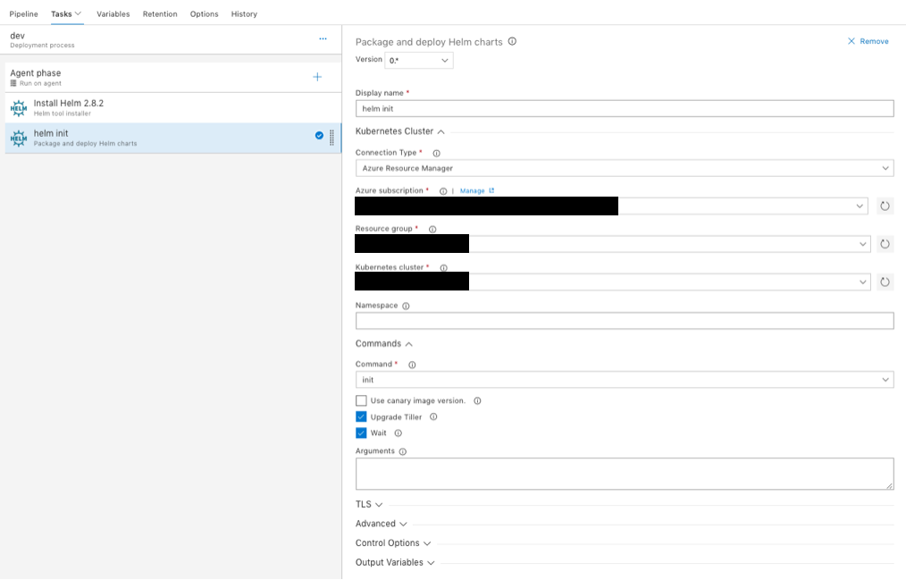

# Continuous Integration Continuous Delivery (CICD) for Azure Kubernetes Clusters (AKS)

## Continuous Integration (CI) using Visual Studio Team Service (VSTS)

* Under your project in VSTS, click "Build and release", and then click "New" to create a *build*

* Select "VSTS Git" and link this *build* to your code repository

* Select "Empty process" to create an empty template

* Type in the *build* name

* Install *helm* tool

* Set *helm lint* to verify the chart for possible issues

* Select "Docker" for the settings related to docker images

* Build a docker image for *robot*

* Push the *robot* docker image to Azure Container Registry

* Build a docker image for *simulator*

* Push the *simulator* docker image to Azure Container Registry

* Copy the helm chart files from *build* to *release*

## Continuous Delivery (CD) using Visual Studio Team Service (VSTS)

* Under your project in VSTS, click "Build and release", and then click "Create a release pipeline" to create a *release*

* Select "Empty process" to create an empty template

* Set a name to your *release*

* Link the artifact from *build*

* In the empty template, install "helm" tool to k8s cluster

* Set the "helm" and connect to your k8s cluster

* Set "Helm upgrade" to deploy your helm chart to your k8s cluster

