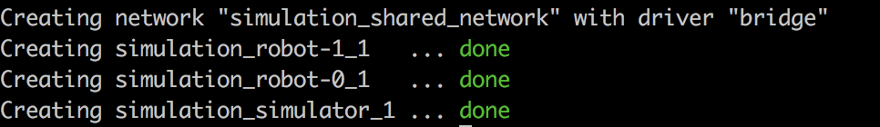

# Running Locally (not recommended)

>Warning: The simulator is compute intensive, and will perform better on a larger dedicated box.

Running locally may be helpful for quick tests and debugging, but due to resource constraints, it can only support a few robots.

## Requirements

- [Docker](https://docs.docker.com/install/)
- [Docker-compose](https://docs.docker.com/compose/)

## Instructions

In the project's root directory, the [docker-compose.yml](../docker-compose.yml) file will bring up 1 simulator and 2 robots.

The docker-compose file references local docker images, so make sure to build them first locally from the root directory:

```console
    # Build the ARGoS base image
> docker build -t argos-base . -f "argos/Dockerfile"
    # Build the ARGoS Simulator image
> docker build -t simulator . -f "Dockerfile-argos"
    # Build the Robot image
> docker build -t robot . -f "Dockerfile-robot"
```

There is no need to push the images to a registry.

### Start the simulation in detached mode (non-blocking)

```bash
> docker-compose up -d
```

On success, the output will look like:



### View logs

```bash
> docker-compose logs simulator
> docker-compose logs robot-0
> docker-compose logs robot-1
```

### Run commands in the containers

```bash
> docker-compose exec simulator /bin/bash
> docker-compose exec robot-0 /bin/bash
> docker-compose exec robot-1 /bin/bash
```

### When finished, bring down the environment

```bash
> docker-compose down
```

## Other Options For Running Locally

### Minikube Cluster

In order to closely replicate a running K8s cluster, set up a Minikube environment locally.

1. Install [Minikube](https://kubernetes.io/docs/tasks/tools/install-minikube/) and set up cluster (image secret and taints).
1. Push Docker images to the registry using ["Container Management"](./ContainerManagement.md) instructions
1. Deploy the helm chart using ["Run Simulation End to End"](./RunSimulationEndToEnd.md) instructions
