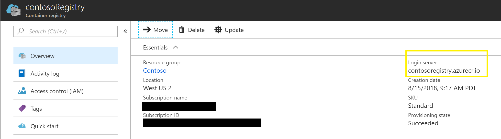
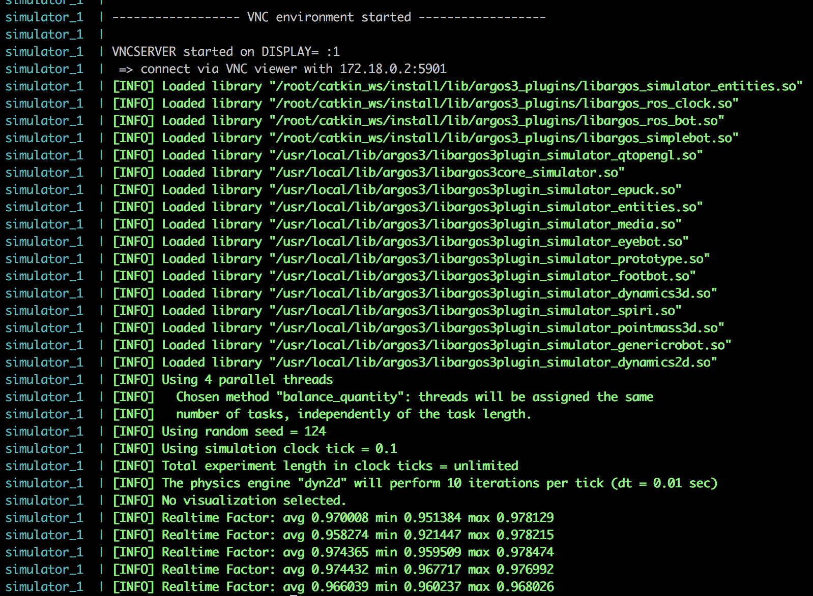
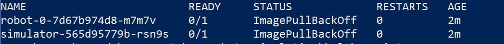

# Run Simulation End to End

This document assumes that the cluster is already up and running with the Robot and ARGoS container images pushed to Azure Container Registry (ACR), and shows how to run the simulation. Information on these previous steps can be found at

* [Environment Setup](EnvironmentSetup.md)
* [Container Management](ContainerManagement.md)
* [Creating the Cluster with ACS Engine (recommended)](ClusterCreation_ACS-Engine.md)
* [Creating the Cluster with AKS (if needed)](ClusterCreation_AKS.md)

The simulation for the robots is set up so that many robots communicate with one simulator. The [visualization](SimulationVisualization.md) is not turned on by default, so running the simulation will not automatically show the graphics. However, information is logged in the robot and simulator nodes of the cluster to show status. For more information on logging, see [Validation](#Validation).

## Configure Cluster

These steps must be repeated only if a new cluster is deployed

### Install Helm on the Cluster

Run the following command:

```> helm init --upgrade```


### Create the Kubernetes Secret

Run the following command, or the [createSecret.ps1](../scripts/createSecret.ps1) script with the required parameters.

```kubectl create secret docker-registry image-secret --docker-server <acr-login-server> --docker-username <appId> --docker-password <password> --docker-email <email-address>```

The appId and password come from the service principal created in [Cluster Creation](ClusterCreation_ACS-Engine.md). The docker-email parameter can be any email. It does not need to be associated with a Docker or Azure account. Find the ACR login server in the azure portal.



## Add Dedicated Node for Simulator

The simulator should run in a dedicated large node on the cluster. This will require a taint on the large node, which will prevent other pods from being scheduled on the dedicated node. In order to add the taint, first get the name of the node by running `kubectl get nodes` and choosing the node with 'simulator' in the name.

To add the dedicated node:

* First, add a label to the correct node:
  * `kubectl label node <node name> dedicated=simulator`
* To add the taint for nodes with that label, run `kubectl taint nodes -l dedicated=simulator dedicated=simulator:NoSchedule`

Or run [taintSimulator.ps1](/scripts/taintSimulator.ps1) with the simulator node name

## Create Helm Release on Kubernetes Cluster

Helm is used to manage packages on a Kubernetes cluster. A release is the term for a Helm Chart that is running on the Kubernetes cluster.

### Configure Helm Release

Before creating a new release, first update the variables in the [values.yaml](../helm/ros-simulation/values.yaml) file.

**The only required changes are to robotCount, simulatorImage, and robotImage.**

| Property                  | Description                                                                                                                                                                                                          | Default                                                                 |
|---------------------------|----------------------------------------------------------------------------------------------------------------------------------------------------------------------------------------------------------------------|-------------------------------------------------------------------------|
| robotPrefix               | Prefix string used as the ros namespace for the robot on the simulator node                                                                                                                                          | robot                                                                   |
| **robotCount**                | Number of robot pods that will be provisioned in Kubernetes and in the simulator                                                                                                                                     | 2                                                                       |
| simulatorThreadCount      | Number of threads used to run simulator. Our recommendation is to set this equal to the number of cores for the simulator node                                                                                            | 4                                                                       |
| registrySecret            | Name of the Kubernetes secret used to store credentials to the Azure Container Registry                                                                                                                              | image-secret                                                            |
| robotTargetPrefix         | Prefix string used as the Kubernetes service name for the robot nimbro service. An index will be appended to the prefix (e.g. robot-nimbro-0).                                                                       | robot-nimbro-                                                           |
| simulatorTargetPrefix     | Prefix string used as the Kubernetes service name for the simulator nimbro service. An index will be appended to the prefix (e.g. simulator-nimbro-0). The index corresponds to the robot index.                     | simulator-nimbro-                                                       |
| portBase                  | Base port used for the nimbro ports. For all robots, this base port is used for nimbro receivers. On the simulator, the base port is the first port open, and successive robot receiver ports are added as 17000 + i | 17000                                                                   |
| nimbroProtocol            | Protocol used for Nimbro. Valid values are "tcp" or "udp".                                                                                                                                                           | tcp                                                                     |
| simulationCallbackTimeout | Simulator will wait at most this timeout period for ros twist messages from the robot.                                                                                                                               | 0.1 (seconds)                                                           |
| vncPassword               | Password to use for the vncserver                                                                                                                                                                                    | vncpassword                                                             |
| **simulatorImage**            | Repository, tag, and pullPolicy for the simulator image.                                                                                                                                                             | repository: contoso.azurecr.io/simulator tag: latest pullPolicy: Always |
| **robotImage**                | Repository, tag, and pullPolicy for the robot image.                                                                                                                                                                 | repository: contoso.azurecr.io/robot tag: latest pullPolicy: Always     |
| resources                 | CPU and memory resource requests and limits for the robot containers. Robots need at least 1 CPU in most cases.                                                                                                      | limits:   cpu: 1   memory: 1024Mi requests:   cpu: 1   memory: 1024Mi   |

### Install Helm Release

To create a release, from the root folder run

```helm install helm/ros-simulation/```

This result will look similar to


## Upgrade Helm Release (if needed)

In the case where an image tag changes, the robot count changes, you will need upgrade the release. To do this without deleting and re-releasing, upgrade from root folder using:
```console

# Get release name
> helm list
# Use release name to upgrade
> helm upgrade <name> helm/ros-simulation/

```

## Delete Release (if needed)

To delete the release, you will need its name
```console

> helm list
> helm delete <name> --purge

```
Using '--purge' for deletion will remove the release name from your history, so that it can be used for another helm install (otherwise, it is kept around for rollbacks). If you do not use the purge option, and you are naming the releases, then you may run into conflicts when installing at a later time.

Ensure all nodes are terminated before creating re-installing the chart

## Validation

To check that the release was successful and that the Kubernetes pods are running correctly, all will show "Running" for the following command. This may take a few moments after creating the release. In the interim, they will show as "ContainerCreating"

```kubectl get pods```

To verify that the simulation is running correctly, check the logs for the simulator and at least one of the robot pods. You should not see any crashes or errors. To get the logs, run ```kubectl logs <name>```

Sample logs for the simulator node showing Real Time Factor:



## Modifying the Simulation

The pieces of the simulation are configurable, from the docker images being pulled to the number of robots or threads for the simulator box. To make these changes, update the [values.yaml](../helm/ros-simulation/values.yaml) file and then [upgrade your release](#Upgrade-Release-if-needed)

## Troubleshooting

If validation fails, check the status of the nodes and pods using:

```console
kubectl get nodes
kubectl get pods
```

If the node crashes, view the logs from the previous container instantiation using:

```kubectl logs <podname> --previous```

### Kubernetes Pods Not Pulling Image

Sometimes the Kubernetes pods cannot pull the Docker image. The result will look like



To resolve,
1. Verify that the name and tag of the images in the [values.yaml](../helm/ros-simulation/values.yaml) match those the pods should pull
1. Verify that permissions are set correctly to read images from the ACR in [Cluster Creation](ClusterCreation_ACS-Engine.md)

### Kubernetes Pod has Status "Pending"

To resolve,
1. Ensure the simulator node was [tainted](#Add-Dedicated-Node-for-Simulator) correctly
1. Provide more resources for the simulation. See [Cluster Scaling](ClusterScaling.md)