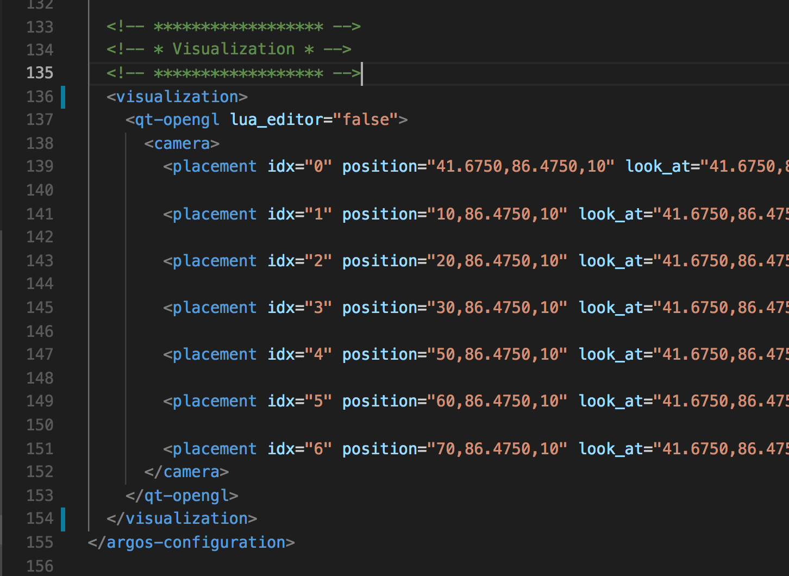
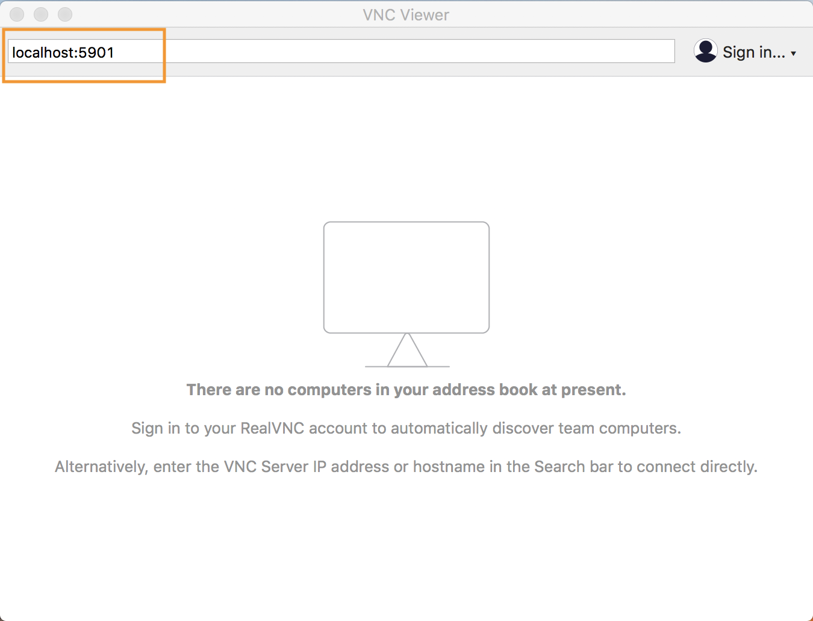
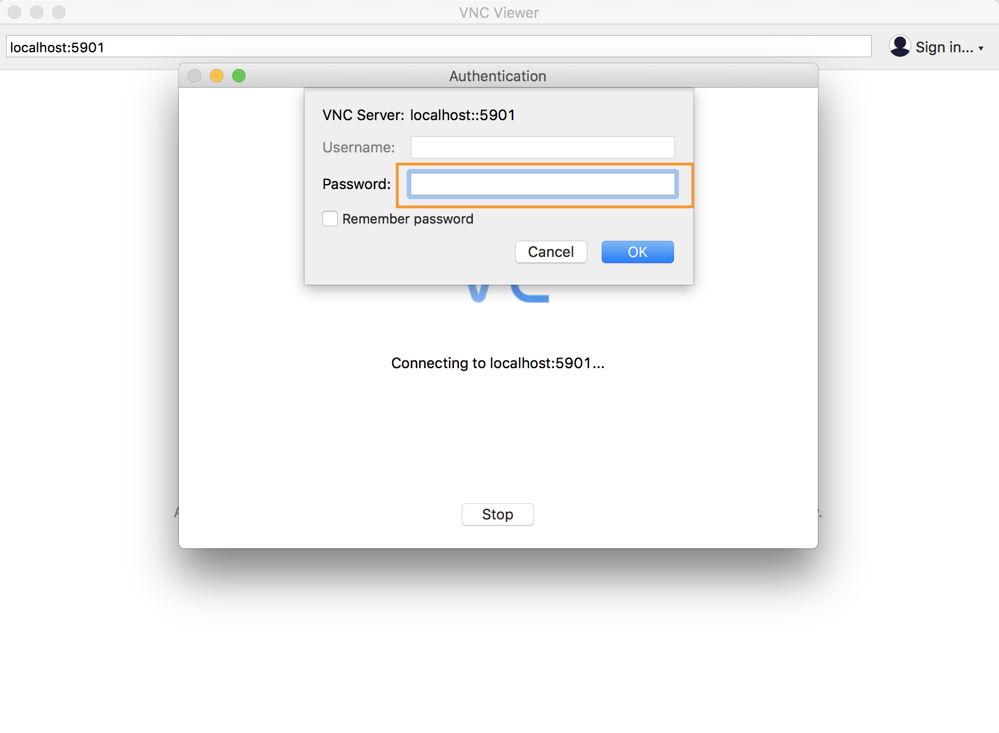
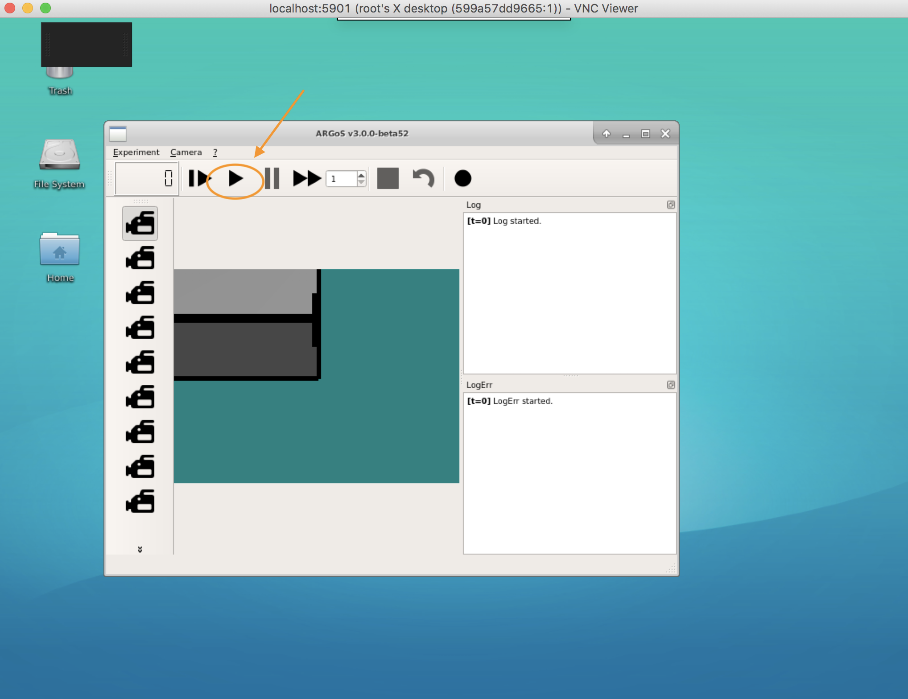

# Simulation Visualization

## Required Tools

- [Docker](https://www.docker.com/)
- [Kubectl](https://kubernetes.io/docs/tasks/tools/install-kubectl/)
- [Real VNC - Viewer](https://www.realvnc.com/en/connect/download/viewer/) or another VNC client

## Step 1: Enable Visualization

To enable visualization, uncomment the `<visualization>` section in the [construct.argos](../src/argos_bridge/argos_worlds/construct.argos) file.

Uncommented visualization tag:

## Step 2: Build/Push the simulator image

Rebuild and push the simulator image using instructions from [Container Management](./ContainerManagement.md).

## Step 3: Deploy the Simulation

Follow the instructions in [Run Simulation End to End](./RunSimulationEndToEnd.md) to deploy the simulation.

> Remember to set the vncPassword in the [values.yaml](../helm/ros-simulation/values.yaml) file

## Step 4: View the Simulation

1. Make sure the simulation is running by checking the status:

    > `kubectl get pods`

1. Port-forward 5901 for the VNC connection. This will map the 5901 port on localhost to the 5901 port in the container.

    > `kubectl port-forward <simulator pod name> 5901:5901`

1. Connect to localhost:5901 using VNC Client.

    

1. Enter the VNC Password:

    

1. Start the simulation:

    >**The simulator will not run automatically when using visualization. It must be started by pressing the Play button.**

    